# Business Case:


In this notebook we aim to answer the following questions using real-estate data from Zillow:
- Which Portland zipcodes should we focus on when deciding to invest in real-estate?
- Which of our focus zipcodes have the highest ROI potential?
- Which of our focus zipcodes have the lowest risk?


# Methodology:

1. Load and filter the data for the chosen zipcode.
2. Intial examination and preprocess the data.
3. Exploration of the data and decide which zip codes will be focused on.
4. Create functions to prep data, run models, and plot results.
5. Perform and evaluate ARMA model for the chosen zip codes.
6. Perform and evaluate ARIMA model for the chosen zip codes.
7. Interpretations and recommendations based on the models and examination of the data.
8. Future work

# Load the Data/Filtering for Chosen Zipcodes


We load the data, ensure it loaded correctly, and take a quick look at .info() to see what we will be working with in this dataframe.


```python
# load dataframe and print head to ensure it loaded correctly
df = pd.read_csv('zillow_data2.csv')
df.head()
```

The data below is from Zillow’s home values data. 

Website:
 https://www.zillow.com/research/data/

Time frame: 1996-01-01 to 2020-01-01


<div>
<style scoped>
    .dataframe tbody tr th:only-of-type {
        vertical-align: middle;
    }

    .dataframe tbody tr th {
        vertical-align: top;
    }

    .dataframe thead th {
        text-align: right;
    }
</style>
<table border="1" class="dataframe">
  <thead>
    <tr style="text-align: right;">
      <th></th>
      <th>RegionID</th>
      <th>SizeRank</th>
      <th>RegionName</th>
      <th>RegionType</th>
      <th>StateName</th>
      <th>State</th>
      <th>City</th>
      <th>Metro</th>
      <th>CountyName</th>
      <th>1996-01</th>
      <th>...</th>
      <th>2020-04</th>
      <th>2020-05</th>
      <th>2020-06</th>
      <th>2020-07</th>
      <th>2020-08</th>
      <th>2020-09</th>
      <th>2020-10</th>
      <th>2020-11</th>
      <th>2020-12</th>
      <th>2021-01</th>
    </tr>
  </thead>
  <tbody>
    <tr>
      <th>0</th>
      <td>61639</td>
      <td>0</td>
      <td>10025</td>
      <td>Zip</td>
      <td>NY</td>
      <td>NY</td>
      <td>New York</td>
      <td>New York-Newark-Jersey City</td>
      <td>New York County</td>
      <td>241494.0</td>
      <td>...</td>
      <td>1184447.0</td>
      <td>1173676.0</td>
      <td>1168681.0</td>
      <td>1163918.0</td>
      <td>1160819.0</td>
      <td>1160123.0</td>
      <td>1152662.0</td>
      <td>1144433.0</td>
      <td>1134469.0</td>
      <td>1119691.0</td>
    </tr>
    <tr>
      <th>1</th>
      <td>84654</td>
      <td>1</td>
      <td>60657</td>
      <td>Zip</td>
      <td>IL</td>
      <td>IL</td>
      <td>Chicago</td>
      <td>Chicago-Naperville-Elgin</td>
      <td>Cook County</td>
      <td>203617.0</td>
      <td>...</td>
      <td>476309.0</td>
      <td>476561.0</td>
      <td>477007.0</td>
      <td>478256.0</td>
      <td>480236.0</td>
      <td>482968.0</td>
      <td>485700.0</td>
      <td>488346.0</td>
      <td>490977.0</td>
      <td>493431.0</td>
    </tr>
    <tr>
      <th>2</th>
      <td>61637</td>
      <td>2</td>
      <td>10023</td>
      <td>Zip</td>
      <td>NY</td>
      <td>NY</td>
      <td>New York</td>
      <td>New York-Newark-Jersey City</td>
      <td>New York County</td>
      <td>208136.0</td>
      <td>...</td>
      <td>1027995.0</td>
      <td>1031797.0</td>
      <td>1034790.0</td>
      <td>1034950.0</td>
      <td>1038246.0</td>
      <td>1049714.0</td>
      <td>1051969.0</td>
      <td>1049421.0</td>
      <td>1042315.0</td>
      <td>1042278.0</td>
    </tr>
    <tr>
      <th>3</th>
      <td>91982</td>
      <td>3</td>
      <td>77494</td>
      <td>Zip</td>
      <td>TX</td>
      <td>TX</td>
      <td>Katy</td>
      <td>Houston-The Woodlands-Sugar Land</td>
      <td>Harris County</td>
      <td>200011.0</td>
      <td>...</td>
      <td>336436.0</td>
      <td>337509.0</td>
      <td>338366.0</td>
      <td>339073.0</td>
      <td>340411.0</td>
      <td>341809.0</td>
      <td>344034.0</td>
      <td>346734.0</td>
      <td>350619.0</td>
      <td>354287.0</td>
    </tr>
    <tr>
      <th>4</th>
      <td>84616</td>
      <td>4</td>
      <td>60614</td>
      <td>Zip</td>
      <td>IL</td>
      <td>IL</td>
      <td>Chicago</td>
      <td>Chicago-Naperville-Elgin</td>
      <td>Cook County</td>
      <td>276628.0</td>
      <td>...</td>
      <td>620228.0</td>
      <td>619997.0</td>
      <td>619999.0</td>
      <td>621109.0</td>
      <td>622569.0</td>
      <td>625369.0</td>
      <td>628093.0</td>
      <td>631084.0</td>
      <td>634026.0</td>
      <td>636670.0</td>
    </tr>
  </tbody>
</table>
<p>5 rows × 310 columns</p>
</div>


Now that we have a basic idea of the data, we need to start filtering for Portland, Oregon. Since there are multiple Portlands in the United States, we will first drop any rows that are outside of Oregon. Then we can create our Portland dataframe and print the head to quickly check that it worked the way we wanted it to.


```python
df_port = df_or.copy()
df_port = df_port[df_port.City == 'Portland']
df_port.head()
```


<div>
<style scoped>
    .dataframe tbody tr th:only-of-type {
        vertical-align: middle;
    }

    .dataframe tbody tr th {
        vertical-align: top;
    }

    .dataframe thead th {
        text-align: right;
    }
</style>
<table border="1" class="dataframe">
  <thead>
    <tr style="text-align: right;">
      <th></th>
      <th>RegionID</th>
      <th>SizeRank</th>
      <th>RegionName</th>
      <th>RegionType</th>
      <th>StateName</th>
      <th>State</th>
      <th>City</th>
      <th>Metro</th>
      <th>CountyName</th>
      <th>1996-01</th>
      <th>...</th>
      <th>2020-04</th>
      <th>2020-05</th>
      <th>2020-06</th>
      <th>2020-07</th>
      <th>2020-08</th>
      <th>2020-09</th>
      <th>2020-10</th>
      <th>2020-11</th>
      <th>2020-12</th>
      <th>2021-01</th>
    </tr>
  </thead>
  <tbody>
    <tr>
      <th>140</th>
      <td>99142</td>
      <td>142</td>
      <td>97229</td>
      <td>Zip</td>
      <td>OR</td>
      <td>OR</td>
      <td>Portland</td>
      <td>Portland-Vancouver-Hillsboro</td>
      <td>Multnomah County</td>
      <td>221270.0</td>
      <td>...</td>
      <td>596116.0</td>
      <td>598702.0</td>
      <td>600036.0</td>
      <td>602351.0</td>
      <td>605526.0</td>
      <td>610575.0</td>
      <td>615934.0</td>
      <td>622193.0</td>
      <td>627338.0</td>
      <td>631184.0</td>
    </tr>
    <tr>
      <th>685</th>
      <td>99120</td>
      <td>691</td>
      <td>97206</td>
      <td>Zip</td>
      <td>OR</td>
      <td>OR</td>
      <td>Portland</td>
      <td>Portland-Vancouver-Hillsboro</td>
      <td>Multnomah County</td>
      <td>102538.0</td>
      <td>...</td>
      <td>402557.0</td>
      <td>405537.0</td>
      <td>408419.0</td>
      <td>412400.0</td>
      <td>416710.0</td>
      <td>422433.0</td>
      <td>427203.0</td>
      <td>431376.0</td>
      <td>434746.0</td>
      <td>438932.0</td>
    </tr>
    <tr>
      <th>1104</th>
      <td>99116</td>
      <td>1114</td>
      <td>97202</td>
      <td>Zip</td>
      <td>OR</td>
      <td>OR</td>
      <td>Portland</td>
      <td>Portland-Vancouver-Hillsboro</td>
      <td>Multnomah County</td>
      <td>145404.0</td>
      <td>...</td>
      <td>541827.0</td>
      <td>545446.0</td>
      <td>549224.0</td>
      <td>555015.0</td>
      <td>561030.0</td>
      <td>568278.0</td>
      <td>574194.0</td>
      <td>579849.0</td>
      <td>584863.0</td>
      <td>590615.0</td>
    </tr>
    <tr>
      <th>1569</th>
      <td>99133</td>
      <td>1585</td>
      <td>97219</td>
      <td>Zip</td>
      <td>OR</td>
      <td>OR</td>
      <td>Portland</td>
      <td>Portland-Vancouver-Hillsboro</td>
      <td>Multnomah County</td>
      <td>171425.0</td>
      <td>...</td>
      <td>516028.0</td>
      <td>519940.0</td>
      <td>523367.0</td>
      <td>527905.0</td>
      <td>532300.0</td>
      <td>538453.0</td>
      <td>543489.0</td>
      <td>548485.0</td>
      <td>552240.0</td>
      <td>556945.0</td>
    </tr>
    <tr>
      <th>1797</th>
      <td>99131</td>
      <td>1813</td>
      <td>97217</td>
      <td>Zip</td>
      <td>OR</td>
      <td>OR</td>
      <td>Portland</td>
      <td>Portland-Vancouver-Hillsboro</td>
      <td>Multnomah County</td>
      <td>95801.0</td>
      <td>...</td>
      <td>456930.0</td>
      <td>460196.0</td>
      <td>464092.0</td>
      <td>468836.0</td>
      <td>473885.0</td>
      <td>479967.0</td>
      <td>485115.0</td>
      <td>490482.0</td>
      <td>494760.0</td>
      <td>500287.0</td>
    </tr>
  </tbody>
</table>
<p>5 rows × 310 columns</p>
</div>


We can drop 'City','State', 'StateName', 'Metro', 'SizeRank', 'CountyName', 'RegionID', 'RegionType' columns since all the data in those columns are either repetitive or irrelevant. 

We now know that Portland has 28 zip codes listed in this data set. We will descide which 5 to focus after we preprocess it.


# Data Preprocessing

Reshape the dataframe from Wide to Long Format so the dates and average prices become columns. Then we examine and process the dataframe.


```python
df_portmelt = df_port.melt( 
            id_vars=['RegionName'],
            var_name='Date', 
            value_name='Avg_Price')
df_portmelt.head()

```


<div>
<style scoped>
    .dataframe tbody tr th:only-of-type {
        vertical-align: middle;
    }

    .dataframe tbody tr th {
        vertical-align: top;
    }

    .dataframe thead th {
        text-align: right;
    }
</style>
<table border="1" class="dataframe">
  <thead>
    <tr style="text-align: right;">
      <th></th>
      <th>RegionName</th>
      <th>Date</th>
      <th>Avg_Price</th>
    </tr>
  </thead>
  <tbody>
    <tr>
      <th>0</th>
      <td>97229</td>
      <td>1996-01</td>
      <td>221270.0</td>
    </tr>
    <tr>
      <th>1</th>
      <td>97206</td>
      <td>1996-01</td>
      <td>102538.0</td>
    </tr>
    <tr>
      <th>2</th>
      <td>97202</td>
      <td>1996-01</td>
      <td>145404.0</td>
    </tr>
    <tr>
      <th>3</th>
      <td>97219</td>
      <td>1996-01</td>
      <td>171425.0</td>
    </tr>
    <tr>
      <th>4</th>
      <td>97217</td>
      <td>1996-01</td>
      <td>95801.0</td>
    </tr>
  </tbody>
</table>
</div>


Now that we have our DataFrame in wide format, we can look at the specifically at the Portland zip codes and get our new DataFrame ready for modeling. 

- First we convert the column 'Date' to datetime format.
- Then we convert RegionName to string as it will be used catergorical not quantatively. We ensure that by add "zip: " before each zipcode.
- Finally, we quickly check for null values but from the examination of .info() above, there should not be any. 


```python
df_portmelt.isnull().sum()
```


    RegionName    0
    Date          0
    Avg_Price     0
    dtype: int64


## Initial EDA

The first plot we will look at is a plot of the average price of homes from all zipcodes in Portland through the years.


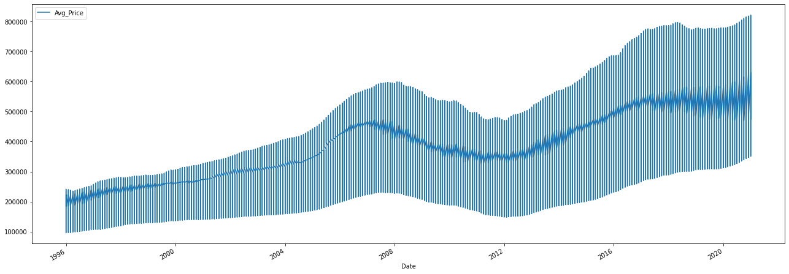


With this initial graph, we can see the overall pattern of all Portland throughout the years. We can see there is a general upward trend with a drop off in 2008 to 2012  which is indicative of the 2008 recession. 

Next we are will look at boxplots and line plot of average price per zipcode. Before we plot the data, we need to group by zipcode (the "RegionName" zipcode).


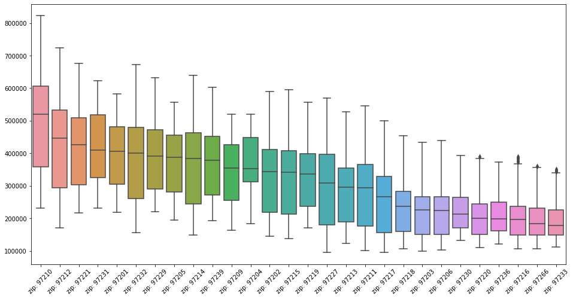


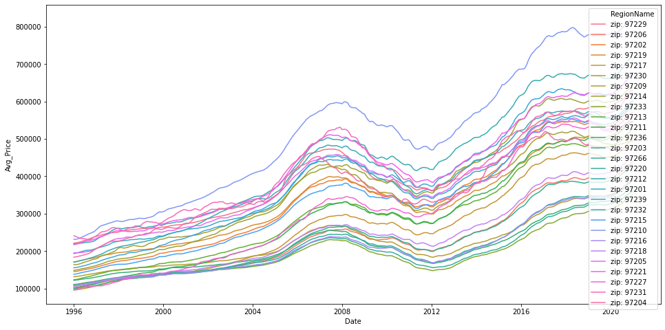


From the two plots above, we can see that 97210 is has a higher average price than the rest of the zipcodes in Portland. We can also see that all zipcodes follow the same trend due to the recession in 2008. 

In order to get a better look at the ranges and medians for the individual zipcodes. We will look at the top 5 of each to decide which we will focus on.


    Top 5 ranges: 
           Range     Zipcode
    20  590763.0  zip: 97210
    15  553765.0  zip: 97212
    18  517222.0  zip: 97232
    7   490296.0  zip: 97214
    25  474070.0  zip: 97227
    
    Top 5 medians: 
    zip: 97210    519076.0
    zip: 97212    446263.0
    zip: 97221    425618.0
    zip: 97231    409086.0
    zip: 97201    406364.0
    dtype: float64


We'll focus on the three highest median average prices and four largest ranges.

- 97210 (highest med and range)
- 97212 (2nd highest med and range)
- 97221 (3rd highest med)
- 97232 (3rd highest range)
- 97914 (4th highest range)


Now that we know which zip codes we will be focusing on, we will group the dataframe by zip code so we will be able to create individual zipcode dataframes.


```python
# Set dataframes that we will be running models on

df_97210 = temp.get_group(zip_focus[0])
df_97212 = temp.get_group(zip_focus[1])
df_97232 = temp.get_group(zip_focus[2])
df_97214 = temp.get_group(zip_focus[3])
df_97221 = temp.get_group(zip_focus[4])  
```

# Functions

Now that we have the five zipcodes we are focusing on, we will create some functions to streamline the process of preparing the data, modeling, and forecasting the data. 

## train_test_split
Will split data fed into the function into 90/10 train/test ratio. 

It returns train and test datasets and plots the break up.


```python
def train_test_split(data):
    """Returns train, test data points
    data split into .90 train and .10 test """
    
    X = data
    train_size = int(len(X) * 0.90)
    train, test = X[0:train_size], X[train_size:len(X)]
    print('Observations: %d' % (len(X)))
    print('Training Observations: %d' % (len(train)))
    print('Testing Observations: %d' % (len(test)))
    plt.plot(train)
    plt.plot(test)
    plt.title("Train/Test Breakup")
    plt.show()
    return train, test
```

## arma_prep
Prepares datasets to be run on the arma model. It includes performing .diff() to detrend the data, printing histogram before and after detrending the data. 


```python
from statsmodels.graphics.tsaplots import plot_pacf
from statsmodels.graphics.tsaplots import plot_acf

def arma_prep(zipcode):
    """Prep for arma modeling and plot histogram, acf, pacf, 
    and autocorrelation. Returns data_diff"""
    
    # grab zipcode from grouped dataframe
    df = temp.get_group(zipcode)
    
    # Set index to the date
    df.set_index('Date', inplace=True)
    # Print histagram before differancing 
    df.hist(grid=False)
    plt.title("Before Differancing")
    
    #Histogram after differencing
    temp1_diff = df.diff().dropna()
    temp1_diff.hist(grid=False)
    plt.title("After Differancing")
    
    # ACF, PACF, and Auto-correclation
    fig, ax = plt.subplots(figsize=(16,3))
    plot_acf(temp1_diff, ax=ax);

    fig, ax = plt.subplots(figsize=(16,3))
    plot_pacf(temp1_diff, ax=ax);
    
    plt.figure(figsize=(12,5))
    pd.plotting.autocorrelation_plot(df)
    return temp1_diff
```

## arma model 
Inputs order into arma model and fits the model. It then plots the prediction vs the true values.


```python
# Import ARMA
from statsmodels.tsa.arima_model import ARMA

def model_arma(train, data):
    
    # Fit an ARMA(1,0) model
    mod_arma = ARMA(train, order=(1,0))
    res_arma = mod_arma.fit()

    # Print out summary information on the fit
    print(f"ARMA (1,0)Summary:\n\n{res_arma.summary()}\n\n")
    
    # Fit an ARMA(2,1) model
    mod_arma2 = ARMA(train, order=(2,1))
    res_arma2 = mod_arma.fit()

    # Print out summary information on the fit
    print(f"ARMA (2,1) Summary:\n\n{res_arma.summary()}\n\n")
    
        
    # Get predictions starting from 2018-07-01 and calculate confidence intervals
    
    print("ARMA prediction vs true values")
    pred = res_arma2.predict(start=pd.to_datetime('2018-07-01'), 
                                 end=pd.to_datetime('2021-01-01'), dynamic=False)

    # Plot real vs predicted values along with confidence interval

#     rcParams['figure.figsize'] = 15, 6

    # Plot observed values
    ax = data['2010':].plot(label='observed')
    
    # Plot predicted values
    pred.plot(ax=ax, label='Avg_Predicted', alpha=0.9)

    
    return 
```

## best_pdq
Calculates and displays the best pdq and pdqs for the data. 


```python
import time
warnings.simplefilter('once', category=UserWarning)

# Function to find best pdq, pdqs

def best_pdq(data, upper_range):
    '''Runs through all possible iterations of pdq to return the one with the
    best AIC'''
    start = time.time()
    # Define the p, d and q parameters to take any value between 0 and 4
    p = d = q = range(0, upper_range)

    # Generate all different combinations of p, q and q triplets
    pdq = list(itertools.product(p, d, q))

    # Generate all different combinations of seasonal p, q and q triplets
    pdqs = [(x[0], x[1], x[2], 12) for x in list(itertools.product(p, d, q))]
    ans = []
    for comb in pdq:
        for combs in pdqs:
            try:
                mod = sm.tsa.statespace.SARIMAX(data,
                                                order=comb,
                                                seasonal_order=combs,
                                                enforce_stationarity=False,
                                                enforce_invertibility=False)

                output = mod.fit()
                ans.append([comb, combs, output.aic])
            except:
                continue
                
        # Find the parameters with minimal AIC value
    ans_df = pd.DataFrame(ans, columns=['pdq', 'pdqs', 'aic'])
    end = time.time()
    print(f"Runtime: {end - start}")
    return ans_df.loc[ans_df['aic'].idxmin()]
```

## arima model
- This function prepares the data for the model by splitting the data 90/10 into train and test data sets. It then plots the split. 
- It then inputs the given parameters and the train data into the ARIMA model.
- It fits the model and prints the results.
- Next it runs and plots model diagnostics
- It runs predictions and compares it to the test data.
- Calculates and returns the rsme
- Forecasts 72 months out using the model and plots the forecast.


```python
import statsmodels as sms
from math import sqrt
from sklearn.metrics import mean_squared_error

# Plug the optimal parameter values into a new SARIMAX model
def arima(data, series_order, season_order):
    '''Train-Test Splits and Runs ARIMA model for series and pdq entered. 
    Prints results plot_diagnostics, and mse.
    Returns rmse and 72 steps out forecast confidense intervals as dataframe'''
    
    # Train-test split 90/10
    X = data
    train_size = int(len(X) * 0.90)
    train, test = X[0:train_size], X[train_size:len(X)]
    print('Observations: %d' % (len(X)))
    print('Training Observations: %d' % (len(train)))
    print('Testing Observations: %d' % (len(test)))
    plt.plot(train)
    plt.plot(test)
    plt.title("Train/Test Breakup")
    plt.show()

    # Plug the parameter values into the model
    ARIMA_MODEL = sm.tsa.statespace.SARIMAX(train, 
                                        order=series_order, 
                                        seasonal_order=season_order, 
                                        enforce_stationarity=False, 
                                        enforce_invertibility=False)

    # Fit the model and print results
    output = ARIMA_MODEL.fit()
    print(output.summary().tables[1])
    output.plot_diagnostics(figsize=(12, 15))
    plt.show()
    
    # Get predictions starting from 2018-07-01 and calculate confidence intervals
    pred = output.get_prediction(start=pd.to_datetime('2018-07-01'), 
                                 end=pd.to_datetime('2021-01-01'), dynamic=False)
    pred_conf = pred.conf_int()
    
    # Plot real vs predicted values along with confidence interval

    rcParams['figure.figsize'] = 10, 6

    # Plot observed values
    ax = data['2010':].plot(label='observed')
    
    # Plot predicted values
    pred.predicted_mean.plot(ax=ax, label='Avg_Predicted', alpha=0.9)

    # Plot the range for confidence intervals
    ax.fill_between(pred_conf.index,
                    pred_conf.iloc[:, 0],
                    pred_conf.iloc[:, 1], color='g', alpha=0.5)
    
    # Set axes labels
    ax.set_xlabel('Date')
    ax.set_ylabel('Avg_Price')
    plt.legend()

    plt.show()

    # Calculate rmse

    # Get the real and predicted values
    temp_pred = pred.predicted_mean
    temp_truth = test['2018-07-01':]
    temp_truth2 = temp_truth['Avg_Price'].resample('MS')

    # Compute the mean square error
    mse = ((temp_pred - temp_truth2) ** 2).mean()
    rmse = np.sqrt(mse)
    
    print('The MSE of our predictions is {}'.format(round(mse, 2)))
    print('The RMSE of our predictions is {}'.format(round(rmse, 2)))

    
    # Get forecast 72 steps ahead in future (6 years)
    forecast = output.get_forecast(steps=72)

    # Get confidence intervals of forecasts
    forecast_conf = forecast.conf_int()

    
    # Plot future predictions with confidence intervals
    ax = data.plot(label='observed', figsize=(15, 7))
    forecast.predicted_mean.plot(ax=ax, label='Forecast')
    ax.fill_between(forecast_conf.index,
                forecast_conf.iloc[:, 0],
                forecast_conf.iloc[:, 1], color='k', alpha=0.25)
    ax.set_xlabel('Date')
    ax.set_ylabel('Avg_Price')

    plt.legend()
    plt.show()
    

    return rmse, forecast_conf
```

## ROI 

This function calculates and the ROI based on the forecast in the ARIMA model. It plots and returns ROI as a dataframe.


```python
def ROI(forecast, original_data, date_purchased):
    '''Calculates and returns ROI (Return on Investment). 
    Prints plot of ROI vs Date. date_purchased must be inputed in quotes'''
    
    # Calculate ROI based on the forecast data from the models
    forecast_mean = forecast["2021-02-01":].mean(axis=1)
    bought = original_data['Avg_Price'][date_purchased]
    ROI = (((forecast_mean-bought)/bought) * 100).round(2)
    
    # Plot ROI
    ax = ROI.plot(label='observed', figsize=(6,4))

    ax.set_xlabel('Date')
    ax.set_ylabel('ROI')

    plt.legend()
    plt.show()
    
    return ROI
```

# Histograms, Autocorrelation, and Partial Autocorrelation


```python
# ARMA prep, differancing, autocorrelation, and partial autocorrelation for zipcode: 97210
arma_97210 = arma_prep('zip: 97210')
```


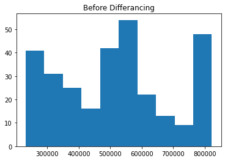

From this, we can see that the data is not stationary. In prder to deal with this, we remove trends using differancing within our function. 

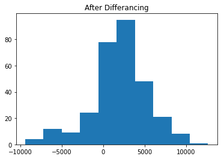

Next, we can look at the correlation and the auto correlation.

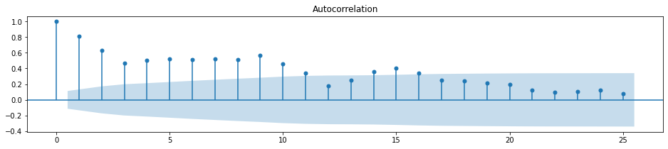


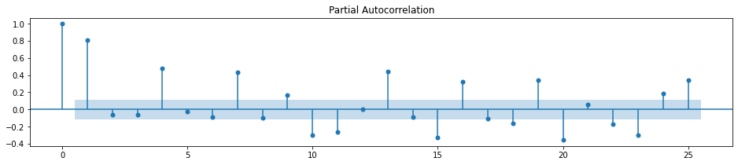


We repeated that process for the 4 other zipcodes as well. 


# Modeling


## ARMA

1. Run the train test split function.
2. Run the ARMA models for our 5 focus zipcodes. These will end up being our base models. 


## ARIMA


1. Run through the best_pdq function to find the optimal pdq, pdqs based on the lowest aic. (commented out due to run time)

2. Set variables for the following to use in the models. 

 For zip code 97210: 
 pdq         (1, 1, 2)
 pdqs    (2, 2, 2, 12)
 aic           3868.99
 
 For zip code 97212:
 pdq         (2, 0, 2)
 pdqs    (2, 2, 2, 12)
 aic           3812.43

 For zip code 97214: 
 pdq         (2, 0, 2)
 pdqs    (2, 2, 2, 12)
 aic           3739.48

 For zip code 97221:
 pdq         (0, 1, 2)
 pdqs    (2, 2, 2, 12)
 aic           3778.14

 For zip code 97232: 
 pdq         (0, 1, 2)
 pdqs    (2, 2, 2, 12)
 aic           3828.61


### Models

Run the ARIMA model function:

1. First it will output the traintest split data:

    Observations: 301
    Training Observations: 270
    Testing Observations: 31

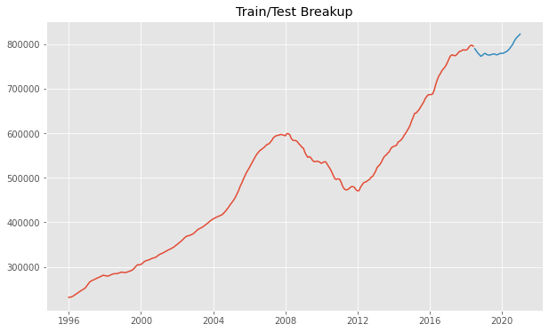

2. It outputs the model data:


3. The model diagnostics:


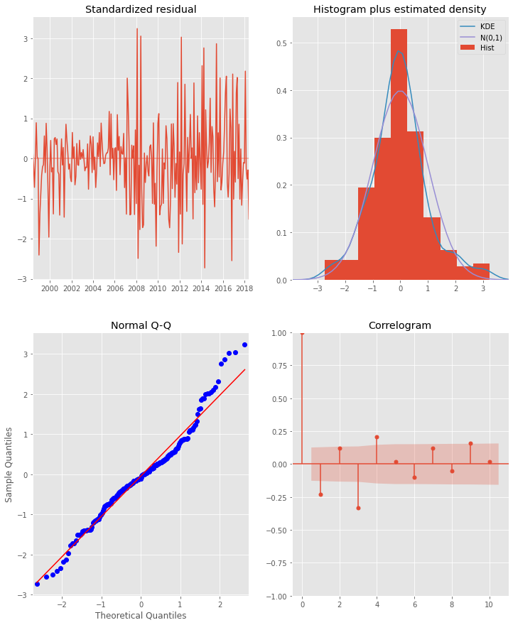


4. It outputs a plot of the actual values vs the our model's prediction.


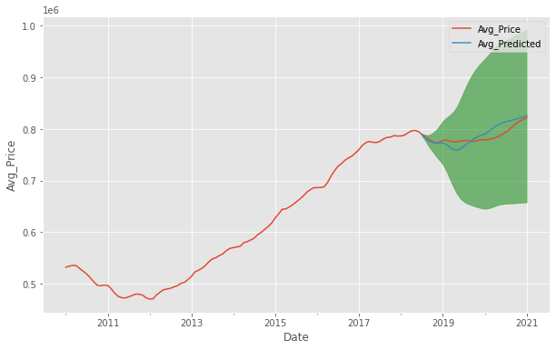

5. The mse amd rmse are displayed.

    The MSE of our predictions is 144340611.02
    The RMSE of our predictions is 12014.18

6. Finally a plot of our model's forecast is displayed. 

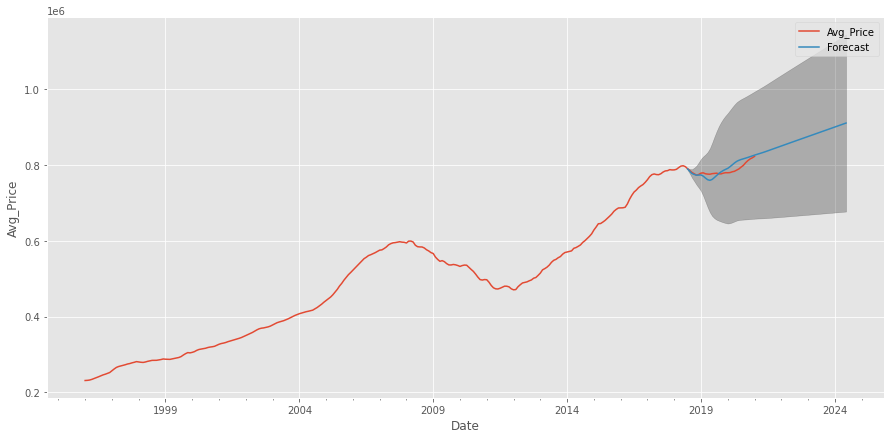


This is repeated for the other 4 zip codes. 


### Return on Investment

Now we can run the forecasts our models produced to plot the average return on investment for the focus zip codes.


Zip code: 97210

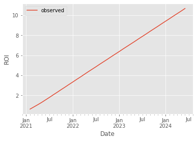

    2023-09-01     8.40
    2023-10-01     8.65
    2023-11-01     8.90
    2023-12-01     9.16
    2024-01-01     9.41
    2024-02-01     9.66
    2024-03-01     9.92
    2024-04-01    10.17
    2024-05-01    10.42
    2024-06-01    10.68
    Freq: MS, dtype: float64


Zip code: 97212

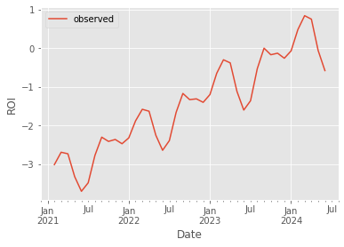

    2023-09-01    0.00
    2023-10-01   -0.17
    2023-11-01   -0.13
    2023-12-01   -0.26
    2024-01-01   -0.07
    2024-02-01    0.48
    2024-03-01    0.84
    2024-04-01    0.75
    2024-05-01   -0.06
    2024-06-01   -0.58
    Freq: MS, dtype: float64


Zip code: 97214


    2023-09-01    11.78
    2023-10-01    12.29
    2023-11-01    12.91
    2023-12-01    12.95
    2024-01-01    13.12
    2024-02-01    13.94
    2024-03-01    14.84
    2024-04-01    15.25
    2024-05-01    14.35
    2024-06-01    13.56
    Freq: MS, dtype: float64


Zip code: 97221

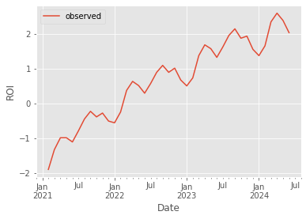

    2023-09-01    2.14
    2023-10-01    1.87
    2023-11-01    1.93
    2023-12-01    1.55
    2024-01-01    1.37
    2024-02-01    1.65
    2024-03-01    2.34
    2024-04-01    2.59
    2024-05-01    2.38
    2024-06-01    2.03
    Freq: MS, dtype: float64


Zip code: 97232


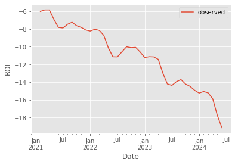

    2023-09-01   -13.71
    2023-10-01   -14.22
    2023-11-01   -14.48
    2023-12-01   -14.92
    2024-01-01   -15.24
    2024-02-01   -15.06
    2024-03-01   -15.22
    2024-04-01   -15.90
    2024-05-01   -17.74
    2024-06-01   -19.15
    Freq: MS, dtype: float64


# Step 6: Interpreting Results

## Recommendations:

The zip code with the best Return on Investment estimate is 97214, but it has a highest rmse meaning the forecast used to calculate possible ROI may not be as reliable. High risk but a chance of a high reward. 

Zip code 97210 has the lowest rmse of 12014.18 making it the most reliable model of the focus zip codes but also has a lower ROI.  

Zip code 97221 is had an ROI that is gradually moving upwards, meaning it might be good for a longer term investment. 


 

## Next Steps:

- Find more in depth data on our focus zipcodes => data that includes things such as:
     - Number of bedrooms/bathrooms
     - Condition of home
     - Square footage
     - Type of home
     - Etc...
- Run models to see what attributes we should look for in a house when buying/selling in desired zipcodes.
- Find fixer-uppers and compare price before/after renovation. 
